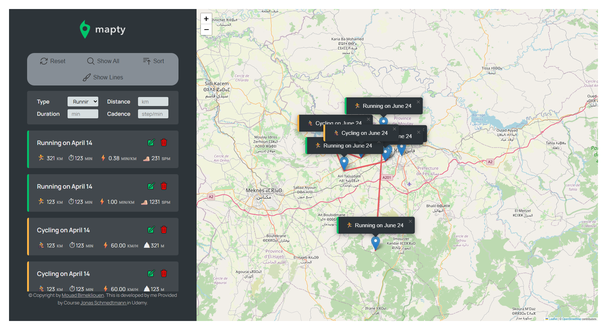
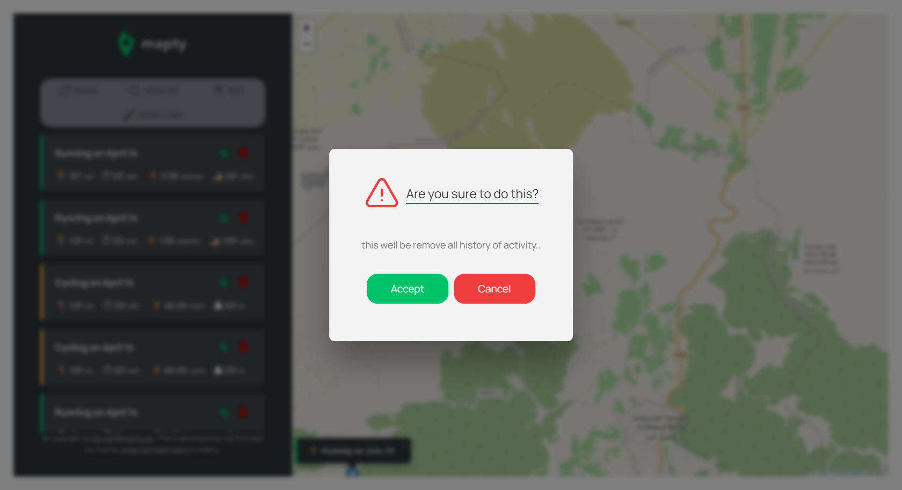
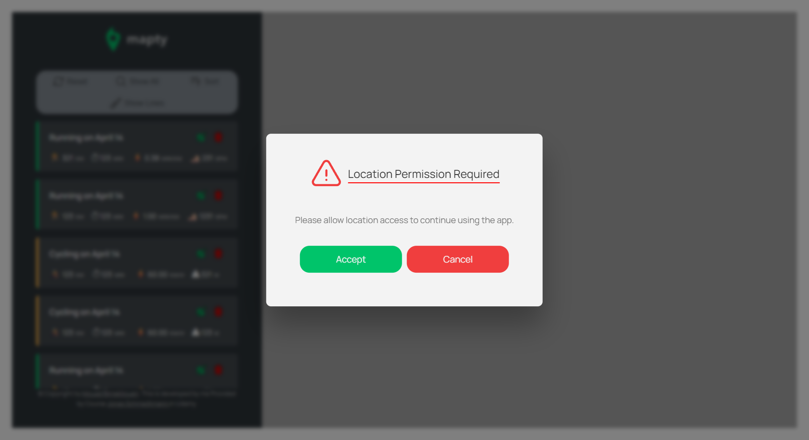

# 💰 Mapty Project

This project focuses on the **Advanced of JavaScript OOP And Methods**, especially working with **New Build In function And All Fundamental of OOP in Javascript** and **DOM** using modern methods and resuble code to develpe my skills in javascript.

## 🚀 Features

- ⚡ Smooth and interactive UI
- ♻️ Reusable functions for clean code
- 📚 Practice with Array methods And All Power of OOP in Javascript (`map`, `filter`, `reduce`, `sort`,`OOP`,`constructor`,`Private & Public methods, variables`, and more...)
- 🧠 Learn how to structure logic with real-world Big Project

## 📸 Screenshots

### 🏠 Full Page

### 🔐 Modal Page

### 🔐 Permissions Request

## 🧪 Try It Yourself

[View](https://mapty-mouad.netlify.app/)
